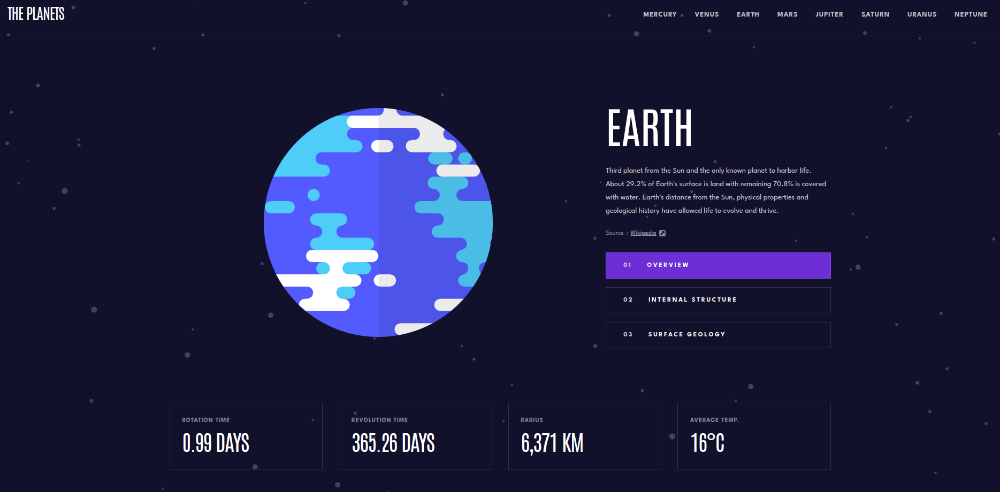

# Planet Facts

This is a solution to the **Planet Facts** challenge on Frontend Mentor. The project is built with React, TypeScript, and Vite, and it utilizes React Router and Styled Components.

## Table of Contents

- [Overview](#overview)
  - [The Challenge](#the-challenge)
  - [Screenshot](#screenshot)
  - [Links](#links)
- [My Process](#my-process)
  - [Built with](#built-with)
  - [What I Learned](#what-i-learned)
  - [Continued Development](#continued-development)
  - [Useful Resources](#useful-resources)
- [Author](#author)

## Overview

### The Challenge

The **Planet Facts** project aims to showcase information about the eight planets in our solar system. Users can view details about each planet, including an overview, internal structure, and surface geology.

### Screenshot

### Links

- Live Site URL: [Planet Facts Live Site](https://teds-planets.netlify.app/)

## My Process

### Built with

- React
- TypeScript
- Vite
- React Router
- Styled Components

### What I Learned

In this project, I had the opportunity to work with React, TypeScript, Vite, React Router, and Styled Components. Some of the key learnings from this project include:

- Efficiently using React components to create a dynamic and responsive UI.
- Leveraging TypeScript to add static typing and improve code maintainability.
- Setting up a project with Vite to enhance development speed and productivity.
- Implementing client-side routing using React Router to navigate between different planet pages.
- Styling components with Styled Components to create a consistent and visually appealing design.

### Continued Development

While working on this project, I encountered some areas I'd like to focus on in future projects:

- Improving my knowledge of advanced TypeScript features to make the most out of its capabilities.
- Enhancing my skills in responsive design to create seamless user experiences across various devices.
- Exploring and implementing additional features to make the application even more engaging and informative.

### Useful Resources

- [React Documentation](https://reactjs.org/docs/getting-started.html) - The official documentation for React.
- [TypeScript Documentation](https://www.typescriptlang.org/docs/) - The official documentation for TypeScript.
- [Vite Documentation](https://vitejs.dev/guide/) - The official documentation for Vite.
- [React Router Documentation](https://reactrouter.com/web/guides/quick-start) - The official documentation for React Router.
- [Styled Components Documentation](https://styled-components.com/docs) - The official documentation for Styled Components.

## Author

- Frontend Mentor - [@Tjanelidze](https://www.frontendmentor.io/profile/Tjanelidze)
- LinkedIn - [@Tedo Janelidze](https://www.linkedin.com/in/tedojanelidze/)
